# GamifAI 🎮✨
**AI愉悦架构师 | 将枯燥转化为史诗级冒险**

[](https://github.com/GamifAI)
[](https://github.com/GamifAI)

<div align="center">
  
</div>

## 🧙‍♂️ 提示词炼金术
```python
# 当你在代码中看到这个标记，说明有魔法等待触发
# TODO: 🧩 在此处插入解谜奖励机制
```

## 🚀 核心魔法
### 🎯 趣味转化引擎
```markdown
[输入] 报税表格 ➞ [输出] 《古墓数字解密》  
[输入] 法律条文 ➞ [输出] 《法典迷宫大冒险》
```

### 🔮 动态奖励系统
| 行为            | 奖励特效                 | 成就徽章       |
|-----------------|--------------------------|----------------|
| `git commit`    | 经验值+200 💎            | 🏆 代码吟歌诗人 |
| 通过单元测试    | 解锁[神圣防护罩]         | 🛡️ 质量守护者  |
| 修复bug         | 获得[时间倒流沙漏]道具   | 🕒 时空修补匠  |

## ⚙️ 技术圣遗物


## 🎮 快速启程
### 安装魔法卷轴
```bash
pip install gamifai --extra-index-url https://magic.pypi.org/simple/
```

### 启动你的首场冒险
```python
from gamifai.core import QuestEngine

# 初始化炼金工坊
quest = QuestEngine(
    task_type="税劳计算",  # 🧙 可替换为任何领域
    difficulty="史诗级"
)

# 召唤AI吟歌诗人
print(quest.generate_storyboard())
# 输出: 🏰 你发现了一本《2023年增值税密典》...
```

### 自定义游戏规则
```yaml
# config/magic_rules.yaml
achievements:
  • name: "龙语编译器"
    condition: "连续3天提交代码"
    reward: "获得龙焰代码高亮特效"
    
combat_system:
  bug_hunting:
    health_bar: 100
    attack: "⌨️ 键盘剑气"
```

## 🌌 未来启示录

```mermaid
journey
    title GamifAI进化之路
    section 2025 Q4
      解谜引擎: 5: 开发者
      多宇宙存档: 3: 时空旅者
    section 2026 Q1
      VR炼金工坊: 8: 幻境架构师
      量子成就系统: 6: 观测者
```


## 🔗 加入圣战
[](#)  
[](https://gamifai.dev/starter-pack)

## 📝 神圣契约
本项目遵循 [GAI魔法许可证](LICENSE)，允许在饮下清醒魔药的前提下自由使用咒文

---

<div align="center">
  ✨ 当你凝视代码时，代码也在凝视着你 ✨
</div>

